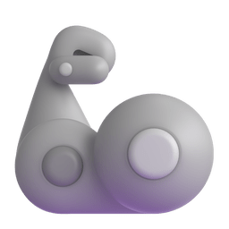

# Hello World! I'm Florian 

## 

Background GIF by [Pixel Jeff](https://fr.pinterest.com/pin/chilling-mario-pixel-art--824158800566782055/) on [Pinterest](https://www.pinterest.com/).

# <picture></picture> About Me:

As a computational neuroscientist in training with a strong interdisciplinary background, I bridge the gap between biomedical sciences, artificial intelligence, and brain-inspired computing.
My journey started with a Bachelor's degree in Biomedical Sciences, followed by a Master's in Artificial Intelligence, and I am currently completing my final Master's in Computational Neuroscience at the University of Sheffield.
  
Through both formal education and self-taught exploration, I've developed a solid understanding of machine learning, neural modeling, and data science, applying these skills to gain deeper insights into the brain and its complex dynamics.
I have experience with neuroinformatics, computational modeling, and AI-driven approaches to neuroscience, as well as hands-on projects like LitteLang, my first web app built entirely from scratch.
  
I'm passionate about creating neuro-inspired algorithms, brain-computer interfaces, and AI tools for healthcare.
My curiosity-driven mindset allows me to learn independently, adapt to new technologies, and collaborate on open-source and research-oriented projects that push the boundaries of both neuroscience and artificial intelligence.
  
I thrive in interdisciplinary environments, where I can connect biology, data science, and technology, and I'm always eager to discuss brain-inspired computing, neurotechnologies, and the future of AI in medicine.
  

 

---

# <picture></picture> Tech Stack:

-   **🖥️ Programming Languages**

-   **🌐 Web Development**

-   **🗄️ Databases**

-   **📊 Data Science & Machine Learning**

-   **🛠️ DevOps & Tools**

-   **🎨 Design & Modeling**

## <picture></picture> Socials:

